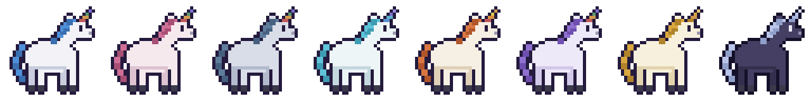
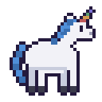
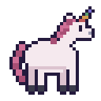
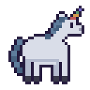
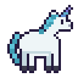
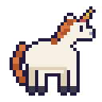
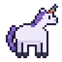
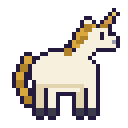
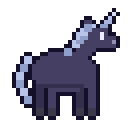
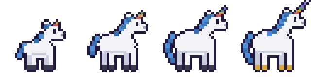

  

<h1 align="center">AiMI — your very own pixel unicorn</h1>

<b>Who has never wanted to pet a unicorn? Now it's possible — and it's all yours!</b>

A tiny unicorn hatches on your screen and just... lives there. It trots along the bottom of your desktop while you work, naps in the afternoon, does sudden zoomies, asks what you're up to, remembers your stories, and grows up by your side — from a wobbly little foal all the way to a legendary unicorn.

**And it never, ever stresses you out.** Nothing decays, nothing dies, nothing guilt-trips. Ignore it for a week — it greets you back with a present. Everything you do together only adds: XP, level-ups with confetti, surprise gifts, rare stickers, hats, evolutions.

## Which unicorn will you get?

Every egg hatches into a **random coat**. You can't pick it, you can't reroll it, you can't change it. That's destiny — and some destinies are rarer than others:

| | Coat | Rarity | Chance |
|---|---|---|---|
|  | **Snow** | Common | ~25% |
|  | **Rose** | Common | ~25% |
|  | **Storm** | Common | ~25% |
|  | **Frost** | Uncommon | ~7.5% |
|  | **Ember** | Uncommon | ~7.5% |
|  | **Lilac** | Uncommon | ~7.5% |
|  | **Golden** | Rare | ~3% |
|  | **Midnight** | **Legendary** | ~1% |

## It grows up with you

Play together, chat, win minigames — everything earns XP, and your unicorn matures through four life stages. It literally gets bigger on your screen, its horn grows, its mane flows, and the legendary form walks on golden hooves:

   
  Foal (lv 1) → Yearling (lv 4) → Unicorn (lv 10) → Legendary Unicorn (lv 18)

## What it does all day

- **Lives on your screen** — wanders, naps at night, blinks, grazes when you feed it. Pick it up and throw it; it bounces (it's fine, it loves it).
- **Talks with you** — give it a brain (any AI works, including a free one that runs on your Mac) and it chats in little pixel speech bubbles, asks about your day, and celebrates whatever you're doing.
- **Remembers you** — tell it about your job, your dog, your projects... it keeps compact little memories and brings them up later. You can read and erase everything it knows, anytime.
- **Can peek at your screen** — only when you say yes. Show it what you're working on and it reacts. Share a YouTube link and it knows what you're watching.
- **Showers you with dopamine** — XP for everything, coins, a 21-sticker album with rarity tiers, daily gifts, streaks that never punish, three minigames (Catch the Treat, Pong vs Pet, Tic Tac Paw), and hats. Yes, hats.

## Tutorial — adopt yours in 2 minutes

**1. Install it**
- Grab the `.dmg` from [Releases](../../releases) (`arm64` for Apple Silicon Macs, the other one for Intel).
- Open it, drag **AiMI** into Applications.
- First launch only: **right-click the app → Open** (it's an indie build, macOS asks once).

**2. Hatch your egg**
- A wild egg appears! Name your unicorn and hit HATCH.
- The dice roll your coat color. Screenshot the reveal — bragging rights if it's Midnight.

**3. Give it a brain (optional but magic)**
- Click your unicorn → **SETUP** → pick a provider.
- **Free & private**: install [Ollama](https://ollama.com), run `ollama pull ministral-3:8b`, pick "Ollama local" — everything stays on your Mac.
- Or paste an API key from Anthropic, OpenAI, Google, Mistral, or any compatible service.
- Hit **TEST CONNECTION**, then **SAVE**. No brain? It's still a full virtual pet.

**4. Play**
- **Click your unicorn** for the menu: treat it, pet it, play games, chat, open the sticker album.
- **Drag it** anywhere — it dangles, falls, bounces.
- **Open gifts** when they appear. Answer its questions (it's how it learns about you — and you get XP).
- Click anywhere else to tidy panels away. It sleeps when you work late. It's just... there with you.

**5. Daily life**
- The unicorn head in your **menu bar** has Show/Hide, Settings and Quit.
- Settings → Pet: rename it, mute sounds, **open at login** (recommended — it greets you every morning), privacy toggles, and quit.
- What it knows about you lives in Settings → Memory — read it, delete single memories, or wipe it all.

## Your privacy, in plain words

Everything lives on your Mac. No account, no telemetry, no cloud of ours. Your API key is stored encrypted. Screenshots happen only when you click yes, go straight to *your* chosen AI, and are never saved. The only network traffic is your unicorn talking to the brain you gave it.

## For tinkerers

Electron + TypeScript. `npm install && npm run dev` to hack, `npm run dist` to build, `npm run sprites` to regenerate every unicorn from code. Art system and modding notes in [docs/SKINS.md](docs/SKINS.md). License: [MIT](LICENSE) — the unicorn is yours now.
